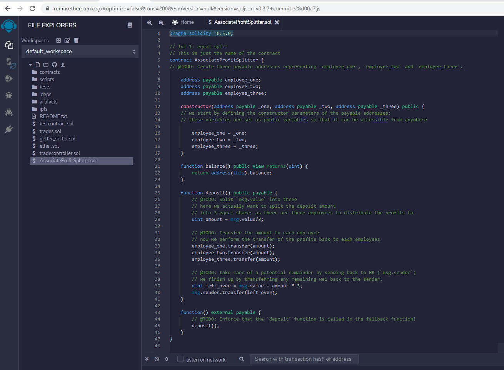

# smart-contracts

With a new startup created with its own Ethereum-compatible blockchain to help connect financial institutions. The team wants to build smart contracts to automate some company finances to make everyone's lives easier, increase transparency, and to make accounting and auditing practically automatic!

This repo aims to demonstrate how smart contracts with Solidity can be used to Pay your Associate-level employees quickly and easily.   

# Designing the Contract

As you can see from the contract setup, it follows the following logic:

- split the profit into 3 equal shares. 
- send/transfer the profit split to each employee
- transfer the remainder back to the sender

  

# Tesing the Contract

Below are steps performed in order to test the contract:

### **Connect Metamask to local network**

### **Configure the Compiler and ensure the version matches**

### **Click on 'solidity compiler' and then Compile**

### **Click on 'deploy and run transactions' and Configure as Follows:**

### **Configure the Contract Addresses** 
Click on the dropdown to the right of the 'deploy' button and complete the contract addresses.

### **Click on Deploy** 
 
 
 
 
 

### **Perform a Transaction** 
 
 
 
 
 

As you can see after the deposit was made, the balance for the main account
was reduced and the accounts for the 3 employees was equally increased.